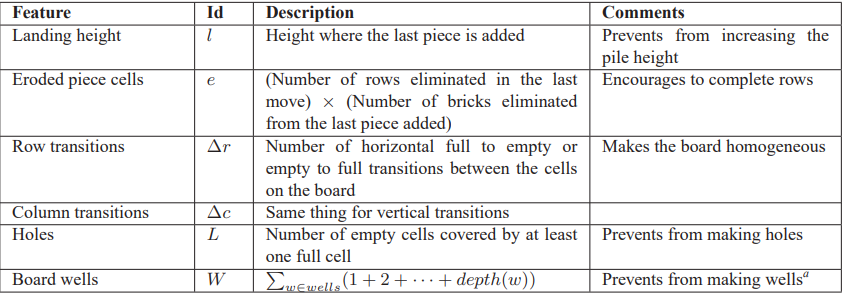
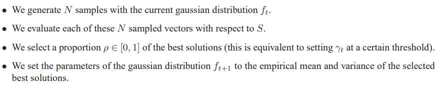
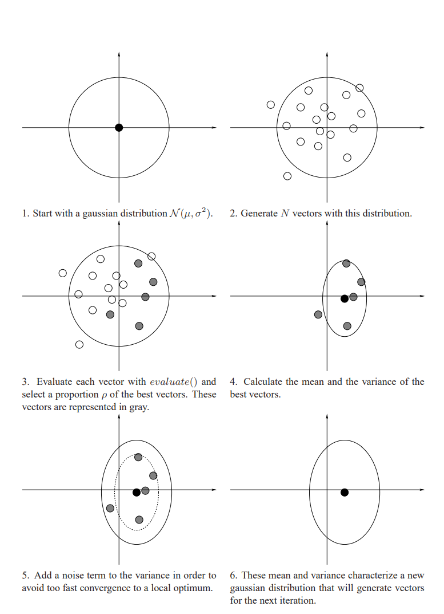

## Accelerating PyTorch: Custom CUDA Extensions for Unparalleled Performance

### Introduction
Although creating custom CUDA extensions to try to improve the performance of PyTorch may sound daunting,
it is simpler than you may think. I have a lot of experience in PyTorch coming from an ML
background but only have recently picked up on CUDA programming from taking a Parallel Programming
Course. I hope this blog post shows how even a relative beginner at CUDA can come up with a specific application,
write a CUDA kernel to speed it up, wrap that CUDA kernel so that it can be executed in Python and use it
in downstream tasks.
### Inspiration
The algorithm I chose to focus on is the Cross-Entropy Method Algorithm.
The inspiration from this comes from the algorithm that almost perfectly 
plays Tetris. If you look at the best Tetris-playing bot, you will
see that the Cross-Entropy Method is the leader even compared to 
neural network-based approaches that exist today.
Here is the algorithm in my own words:
1. Compute all possible next moves(Where/What block you will place)
2. For each next state of the game, compute features for that state.
3. Weight each feature by a weight $w_i$ and sum them up to get a value for the possible next states.
4. Choose the action that takes you to 
5. Repeat
   
Here are the commonly used features in the algorithm:



If you look at step 3, we need to figure out good weights for each of these features to determine how good a state is.

How do we do that?

That's where the Cross Entropy Method comes into play.

We first start with a vector of random weights $\mu$ and $\sigma$ vector of the standard deviation of each of those weights(ex: all 1 at the beginning)

Then we apply the CEM algorithm as shown below:

Here is an Overview of the algorithm:



Here is a visual representation of that same algorithm:



This is very similar to evolutionary algorithms, and by using CEM for many iterations, 
slowly the weights you choose will become better and better.

The CEM algorithm has 4 main steps, but I decided to try and speed up the first step: Generate N random Vectors from a Normal Distribution

This step is the most general and is used everywhere in scientific computing and is a very general operation.

### Algorithm
If we focus on how to sample from a Normal Distribution, we can use the following formulation.
$$X \sim N(\mu, \sigma^2)$$

$$X = \mu + Z\sigma$$

$$Z \sim N(0,1)$$

We can extend this to multi-dimension vectors as follows:
Lets say our $\mu$ and $\sigma$ are d dimensional vectors and we are trying to sample N random vectors:


With the Broadcasting of these tensors, we end up with a tensor of shape (d x N) which represents our N randomly 
sampled vectors of dimension d which is our desired output.

### Pytorch Implementation

### How to Develop CUDA custom C++ extensions for PyTorch

### CUDA Implementation

### Benchmarks

### Conclusion

#### Some Python Code
```python
import torch
a = torch.pow(3,2)
print(a)
```
